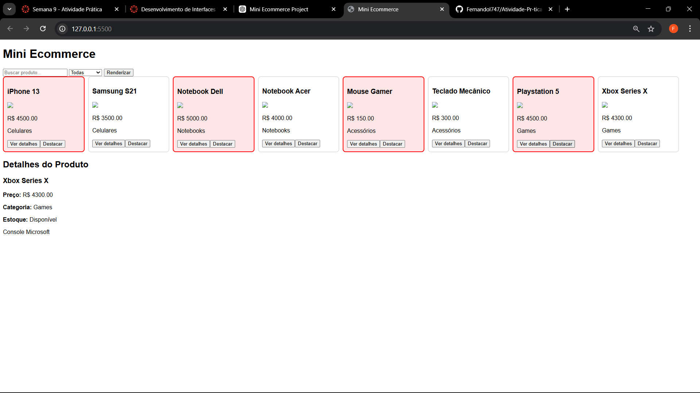
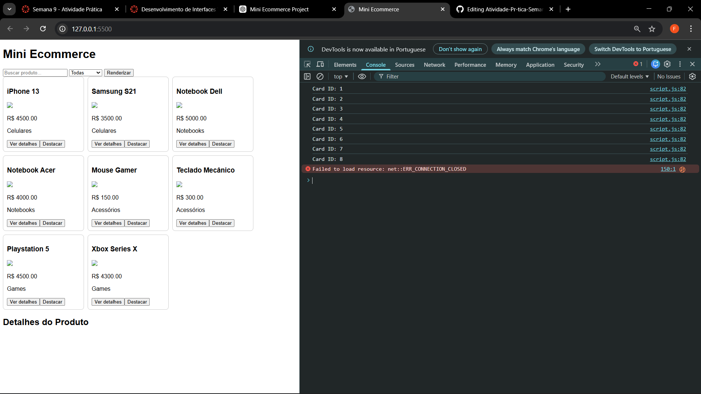

# Atividade-Pr-tica-Semana-9

# Nome: Fernando Gomes Reis de Resende
# Número de matrícula: 919379

# Print com os cards renderizados e a área de detalhes preenchida após clicar em “Ver detalhes”:

# Um print do Console do navegador mostrando alguma saída gerada por você (ex.: listagem de data-id via querySelectorAll):
